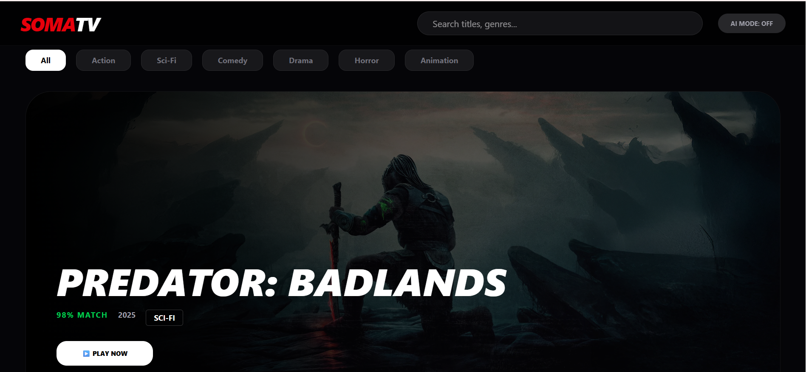
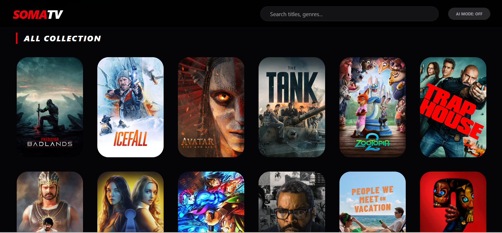
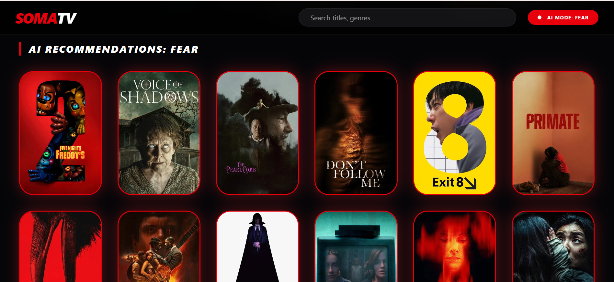
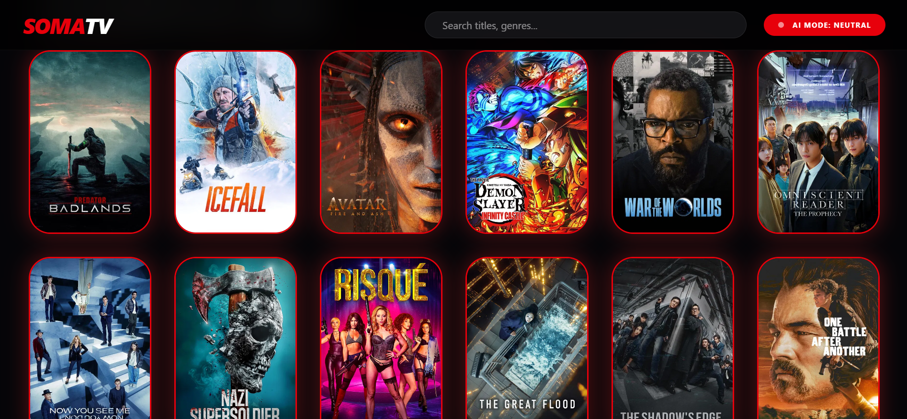
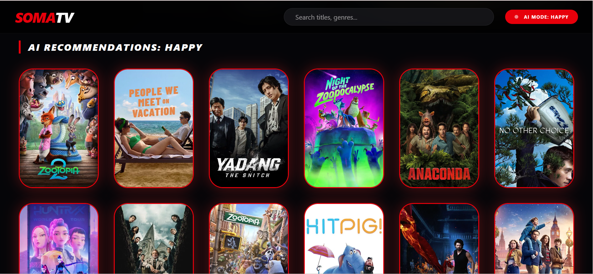
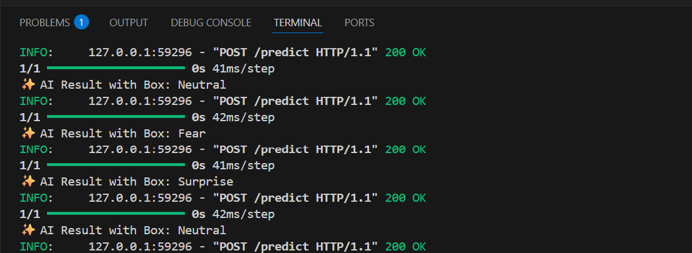

# SomaTV - AI Movie Recommender 🎬

**SomaTV** is an innovative AI-powered web application that recommends movies based on the user's real-time emotions. By leveraging Deep Learning and Computer Vision, the app analyzes facial expressions to suggest the perfect film for your current mood.

## ✨ Key Features

- **Real-time Emotion Detection:** Uses a CNN model trained on the FER2013 dataset to detect emotions (Happy, Neutral, Sad, etc.) with ultra-low latency (~40ms).
- **Mood-Based Recommendations:** Dynamic filtering of movies using the TMDB API based on detected emotions.
- **Privacy-First Design:** Features a dedicated "AI Mode" toggle to give users full control over their camera and privacy.
- **Cinematic UI:** A modern, responsive interface built with React for an immersive experience.

## 🚀 Tech Stack

- **Frontend:** React.js, Axios, Tailwind CSS, Framer Motion
- **Backend:** FastAPI (Python), Uvicorn
- **AI/ML:** TensorFlow/Keras, OpenCV
- **Data:** TMDB API for movie metadata

## 📸 Demo & Screenshots

### Application Interface



### Emotion Detection in Action



### AI-Powered Recommendations



### Feature Showcase



### User Experience



### Real-time Analysis



## 🛠️ How to Run

### Backend Setup:

```bash
cd backend
python -m uvicorn main:app --reload
```

The backend will run on `http://127.0.0.1:8000`

### Frontend Setup:

```bash
cd frontend
npm install
npm run dev
```

The frontend will run on `http://localhost:5173`

## 📋 Project Structure

```
SOMATV/
├── backend/
│   ├── main.py              # FastAPI server with emotion prediction
│   ├── api.py               # Alternative API implementation
│   ├── emotion_model.h5     # Pre-trained CNN model
│   └── tempCodeRunnerFile.py
├── frontend/
│   ├── src/
│   │   ├── SomaTV.jsx       # Main app component
│   │   ├── App.jsx          # App wrapper
│   │   ├── main.jsx         # Entry point
│   │   ├── index.css        # Global styles
│   │   └── App.css          # App styles
│   ├── vite.config.js
│   ├── tailwind.config.js
│   ├── package.json
│   └── index.html
├── demo/                    # Demo screenshots
└── README.md
```

## 🔧 Configuration

### TMDB API Key

To use the movie recommendations feature, you need to add your TMDB API key:

1. Go to [The Movie Database (TMDB)](https://www.themoviedb.org/settings/api)
2. Get your API key
3. Update the `API_KEY` variable in `frontend/src/SomaTV.jsx`

## 🎯 How It Works

1. **Camera Capture:** The app captures video frames from your webcam
2. **Emotion Detection:** Sends frames to the backend AI model every 3 seconds
3. **Mood Analysis:** TensorFlow model predicts your current emotion
4. **Smart Filtering:** TMDB API is queried and results are filtered based on your mood
5. **Dynamic Display:** Movies matching your mood are highlighted in red

### Mood to Genre Mapping

- **Happy** → Comedy, Animation
- **Sad** → Drama
- **Angry** → Action
- **Fear** → Horror
- **Neutral** → All genres

## 🎨 UI Features

- **Dark cinematic theme** with modern glassmorphism design
- **Real-time mood display** in the header
- **Animated movie cards** with hover effects
- **Category filters** for easy navigation
- **Search functionality** to find specific movies
- **AI Mode toggle** for privacy control

## 📊 Performance

The backend is optimized for performance, handling emotion detection requests in approximately **40ms**, ensuring a smooth and "live" recommendation feel.

## 🤝 Contributing

Contributions are welcome! Feel free to fork this repository and submit pull requests.

## 📝 License

This project is open source and available under the MIT License.

## 👨‍💻 Author

**SomaTV Development Team** - 2026

---

**© 2026 SOMATV - AI DRIVEN STREAMING** 🎬✨
